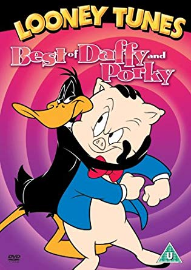

# Exercise - Looney Tunes

This is Part 2 of Funny Talk.



### Daffy Duck: Easy

This is an easy one just for fun. Write a method that takes in a string and replaces all the "s" characters with "th".

Example:

```ruby
daffify("This is ridiculous") == "Thith ith ridiculouth"
```


### Porky Pig: little trickier

[Bob Bergens](https://www.youtube.com/watch?v=lXC_j5QB6v8), the current voice of porky pig did an interview for the documentary "I know that Voice", where he says that there is a formula to talking like Porky. The key is four sounds and then the word with an emphasis on the third sound for all nouns. Write a method that takes a word and creates the following pattern from that word.

```ruby
"boy" -> "eh beh BEH eh boy"
"chair" -> "eh ch CH eh chair"
"desk" -> "eh deh DEH eh desk"
```

The pattern is easy to work out. The second and third sounds are the first two letters of the word unless the second letter is a vowel. In that case it is the first letter followed by "eh". He doesn't stutter on non-vowels or words begining with a vowel. The third sound must be capitalized.

Later we can download the entire list of words from a ruby library. For now, you can include a dictionary (an array of words that you build) of appropriate nouns you want replaced within the sentences for your driver code/spec.

Example:

```ruby
dictionary = ["this", "place", "tomorrow", "rust"]

porkify("this is a nice place", dictionary) -> "eh th TH eh this is a nice eh pl PL eh place."
```

# Commit 0 - Research

Use RegEx combined with `#gsub` or `#split` from the [String factory methods](https://ruby-doc.org/core-2.4.0/String.html) to solve the following problems.

# Commit 1.a - Pseudocode for Daffy Speak

Start with just `daffify`

Before you write your ruby code, write down the input and the output (data type and example of each, EX: Array of Integers, [1,2,3,4] ) In this case, you are given the example input in the runner code on the solution file an expected output up above. Then write a list of steps to complete the task. Remember to use plain english and be percise in your steps. Hint: try writing out your list then reorder before translating your pseudocode into ruby.

# Commit 2.a - Solution for Daffy Speak

Write your solution for `daffify`.

# Commit 3.a - Write Runner Code / Tests for Daffy Speak

Add runner code or multiple tests for `daffify`, like this example.

```ruby
puts daffify("This is ridiculous") == "Thith ith ridiculouth"
puts daffify("That's why I always work solo") == "That'th why I alwayth work tholo"
puts daffify("Such a sourpuss") == "Thuch a thourputh" # bonus, needs more logic
```

# Commit 1.b - Pseudocode for Porky Speak

Write pseudocode for `porkify`

# Commit 2.b - Initial Solution for Porky Speak

Write your initial solution for `porkify`

# Commit 3.b - Write Runner Code / Tests for Porky Speak

Write runner code or tests for `porkify`

# Commit 4 - Refactor Porky Speak

Comment out the initial solution. Copy and paste your method to the `Refactor Solution` section and clean up your code so it is written cleaner, more readable, or is borken into smaller single-purpose methods.

# Bonus 1 -  Pig Latin: Master translator

Write another method that converts a string into pig latin. Use your Regular expressions.

The rules for pig latin are listed [here](http://en.wikipedia.org/wiki/Pig_Latin). You know what to do!

# Bonus 2 -  More Words

This will definitely take some research. see if you can find a ruby gem, library, or api (example: [wordnik](https://developer.wordnik.com/docs#!/word/getDefinitions)) that can identify all nouns.

# Resources

