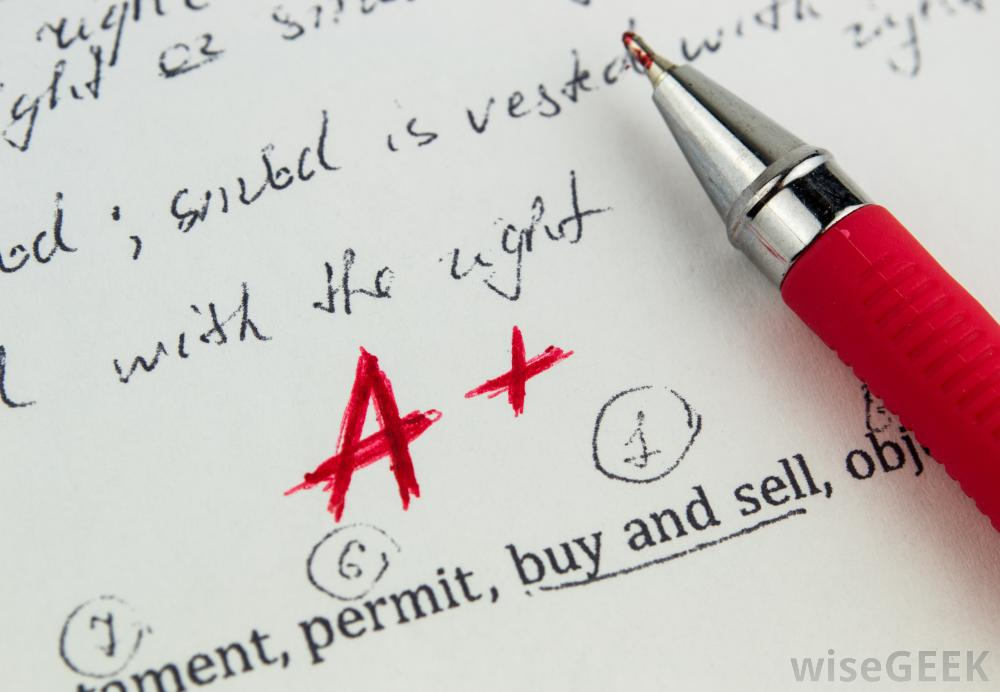

# Exercise - Letter Grades



You are a PolySci professor at a Northwestern University. You have 4 classes a week, each of which have near 200 students. You are busy with so many tasks including writing a dissertation on 'Why we should throw out the multiparty system', a board meeting coming up on adding a new wing to Cook Hall, and Dr. James won't stop stealing your yogurt from the fridge even though your name was clearly written on the side... Anyway, your mind is on more important things. 

Your way of grading for the class is based on taking the number grade from each test given through out the course then finding the average (mean) and converting it into a letter grade. It's the end of the school year and you have to tally up all the grades for 800 some students.

You decide it's easier to automate the process with a method called `#calculate_letter_grade`. 

### Rules

1. The method should accept any number of arguments as integers from `0` to `100` representing a percentage grade for a test. 
2. Each of your courses have a different number of tests so don't assume a certain amount of percentage grades that you are using to calculate the letter grade.
3. You must find the average (mean) of all percentage grades for one student at a time.
3. The method should return a single letter for that student - `"A"`, `"B"`, `"C"`, `"D"`, or `"F"`. If you don't remember letter grades A is 90% and up, B is 80% upto 90%, C is 70% upto 80%, D is 60% upto 70%, and F is lower than 60%.

Example: 

```ruby
calculate_letter_grade(90, 100, 95) #=> "A"
```

# Commit 0 - Research

### Definitions:

- A `Parameter` of a method, defines what information a method can accept or you could say "what a method is asking for". This is written in the parenteses after defining the name of the method. A parameter "defines" the conditions of an opperation
- An `Argument` is a piece of data that you are giving to a method or "passing into a method". This is written when you are running a method. An argument is a "value" passed to a procedure, function or method at the time of call.

These terms are mostly used interchangably unless you are specifically describing the difference between them. So some documentation won't make a distinction... but you know now. 

### Trial:

Have you tried making a method with no parameters and passing in an argument? or a method with three defined parameters and give it 2 arguments? What error do you get?

Try this code in a new file and take a second to figure out how this is collecting the arguments.

```ruby
def go(x, *args) # parameters
  puts args.inspect
end

go("a", "b", "c") #arguments
```
This is a `splat parameter` that takes in as many arguments as you give it. This could easily be passed in as an array but it prevents your user from needing to format their arguments as an array in certian situations and it's a good tool to know. We'll be using it for this exercise.

Try to get an error by adding or subtracting arguments. Then add more parameters, see what happens.

Check out more information about using splat when asking for and passing in arguments [here](http://blog.honeybadger.io/ruby-splat-array-manipulation-destructuring/).

# Commit 1 - Pseudocode

Before you write your ruby code, write down the input and the output (data type and example of each, EX: Array of Integers, `[1,2,3,4]`). Write a list of steps to complete the task. Remember to use plain english and be percise in your steps.

# Commit 2 - Initial Solution

Convert your pseudocode into ruby code. Remember to use a splat parameter.

# Commit 3 - Write Runner Code / Tests

Call your method a couple times with different amounts of arguments and expecting different letter grades.

# Commit 4 - Refactor Solution

Comment out your initial solution, copy and paste your method into the `Refactor Solution` section and refactor.

# Bonus 1 - Add + and -

Change the code so if allows for `-` and `+` additions, such as `"C+"` or `"A-"`

# Bonus 2 - Grade the students

Do research on reading a `CSV` file with Ruby. There is a file called `grades.csv` in the resources folder containing all 800 students with their name and their grades. Pull in the information from the file and calculate all letter grades for the students. Note: you may want to display that information in a print out of some kind where you can see the Student's name next to the letter grade. Do you want to work on making the print out attractive? Do your want to store it in another CSV file or a JSON file so it can be accessed later? It's up to you, what do you want to do with your processed data?

There's information [here](http://blog.honeybadger.io/ruby-splat-array-manipulation-destructuring/) on passing an array into a method using splat (opposite of what we just did).
# Resources

