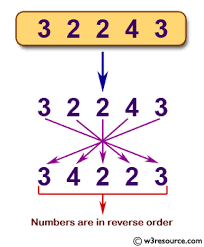

# Exercise - Reverse a Number

It's time to be a mob accountant and juggle some numbers. We want to write a method that takes in an integer such as `12345` and return an integer of `54321`.

This is a deceptive method to write but we will start with the easy version and then move to the more advanced.

# Commit 0 - Research

Familiarize yourself with some String and Integer methods. When thinking through this problem, really explore some options before deciding on a plan of attack. Don't rush.

  - [String](https://ruby-doc.org/core-2.4.0/String.html), don't use the `#reverse` method.
  - [Numeric (Integer inherits from this)](https://ruby-doc.com/docs/ProgrammingRuby/html/ref_c_numeric.html), don't use `#divmod` because they won't accept it in an interview, but it's a good one to know.
  - [Arithmetic Operators](https://www.w3resource.com/ruby/ruby-arithmetic-operators.php)

# Commit 1 - Pseudocode

- Your input will be an integer greater than 10 that doesn't end in a zero.
- Your output will be an integer where the numeric charaters are reversed

Write your steps in plain english, it is very important to not specify the data types or the methods that you will use to accomplish your goal.

# Commit 2 - String Solution

The obvious way to do this involes converting the number into a list of numeric characters, then reversing the characters, and finally converting the string of reversed characters back into an integer. Note: Your pseudocode should be more specific than this and written in plain english. Don't use the reverse method.

Write your initial solution and make the tests pass. 

# Commit 3 - I've Got No Strings

Hopefully your pseudocode doesn't need to change for the most part, if its truely free of code words there's no reason that you can get rid of the string portion of this challenge all together.

Rewrite your method in the `No Strings Solution` section without ever using a string within your logic. hint it may be helpful at some point to make a second method, but that method can not contain strings either.

This is taken from a real interview question for a developer position.

# Commit 4 - Refactor Solution

Refactor your "No Strings" version of the `reverse_a_number`

# Resources

