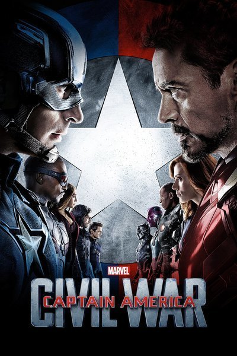

# Exercise - Modeling Superhero Fight

Whether you enjoyed or hated the [Batman vs. Superman](https://www.imdb.com/title/tt2975590/) movie that came out in 2016, it presents an interesting study in Object Oriented Programming (OOP). The idea is to create one `Superhero` class that will work for both an object representing `batman` and an object representing `superman`.

### Superheros have attributes 

- `name` (string, readable), 
- `hitpoints` (integer, writable), 
- `attack` (integer), 
- `alive` (boolean, set automatically as true, writable), 
- `has_special_tool` (boolean, we want to describe if they have a special_tool start automatically to false, readable)
> For each attribute there is a suggestion of making a reader method or a writer method for minimal functionality but you decide if they have to be readable/writable attributes

### Rules

The rules of this exercise is to follow the `Runner Code / Tests`. You can not change the runner code as it will direct you to what is required.

#### Hints

- Notice the attributes are passed into the object as a single hash
- For this class `Superhero`, objects will interact with other `Superhero` objects by passing them into the method arguments. (check Runner Code)
- Superheros can hit, so they need a hit method that takes away hit points from another Superhero object, by the number of attack they have. (again check the Runner Code)
- If a Superhero has a `special_tool` their attack is tripled
- If a Superhero is attacked and their hitpoints are less than 1, they are no longer alive
- A `Superhero` needs a `#grab_tool` method, that sets the `has_special_tool` attribute to true.

# Commit 0 - Research

Look through your notes on making classes if you need to review.

If you need to dive further into Object Oriented Programming, might I suggest the very popular book, [Practical Object Oriented Design in Ruby](http://www.poodr.com/) also known as POODR.

# Commit 1 - Pseudocode

You are now writing multiple methods with in a class. Your pseudocode should include a list of all the methods that you intend to write. The list doesn't have to be complete to start, you can always adjust to your pseudocode later.

### For Each Method 

- Write what information is needed, similar to an input however this may not be an argument. sometimes you just need to know that you have access to an instance variable.
- Write what you want the method to do, specify if it changes an attributes value, prints something to the terminal, returns a value (output) or whatever the desired result of running the method.
- Write down the list of steps, if you expect the method to be longer than one line of code.

# Commit 2 - Solution

Start building your `Superhero` class to make the Runner code work.

# Big Bonus - Marvel's Civil War

Yoou can add to your `Superhero` class so that you can model the fight between the superheros of the [MCU - Marvel Cinamatic Universe](https://en.wikipedia.org/wiki/Marvel_Cinematic_Universe). My suggestion is build the battle in [Captain America: Civil War](https://en.wikipedia.org/wiki/Captain_America:_Civil_War). Comment out the code that you've written so far, then copy and paste your `Superhero` class in the `Civil War Solution` section at the bottom of the solution file. Note: The restraints are off, you can add or subtract any attributes or methods to model this new scenario. You will need to write some additional pseudocode first before diving into this deeper exercise. Go through the list below, what is similar between the heros? what's different? Maybe try using Mixins (Modules) to handle different abilities.

In the movie, there is a battle between two teams of good guys because of reasons that you'll have to see in the movie. If you haven't seen the movie that's ok, just play around with more superheros using the lists below to to get an idea of more superheros and different powers. Here's the list of characters from the "Civil War" movie, their powers and which side they are on. 

#### Captain America's Team

- `Captian America` has a shield that he throws, he's super strong and fast
- `Winter Soldier` has a metal arm and super strong (can hit really hard), can be turned by brainwashing (optional)
- `Falcon` flys, shoots hand guns
- `Hawkeye` shoots arrow (that can explode or stun)
- `Scarlet Witch` can hold people preventing them from action for a turn, shoots energy
- `Ant-Man` can grow (hits hard) or shrink (hard to hit)

#### Iron Man's Team

- `Iron Man` has a suit of armor, shoots rockets, flys, super smart
- `Black Widow` has super agility (back flips, jumping, dodging), fast healing, shoots hand guns
- `War Machine` has a suit of armor, shoots rockets (more damage than iron man), flys
- `Black Panther` has super agility and a special suit that lessens damage
- `Vision` can let hits go right through him some times and shoots a laser from his head
- `Spider-Man` has agility and shoots spiderwebs

Write a battle in the runner code, you could even randomize order or attacks. decide how you want to visually see this battle in the terminal.

#### Recommendation for bonus

- Track the players by making a `Team` class with an attribute of `heros`. `heros` should hold an array of `Superhero` objects. You can then make a method that picks the next player. This can rotate through the `heros` list or randomly select the next person to attack or be attacked. If you have some way of tracking how many times a particular `Superhero` has been played you can make sure it's not 100% random.

